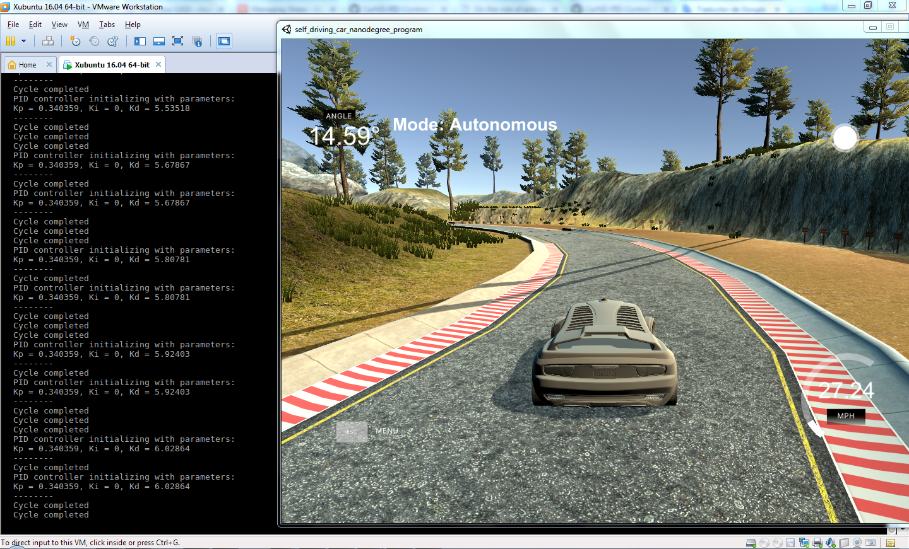
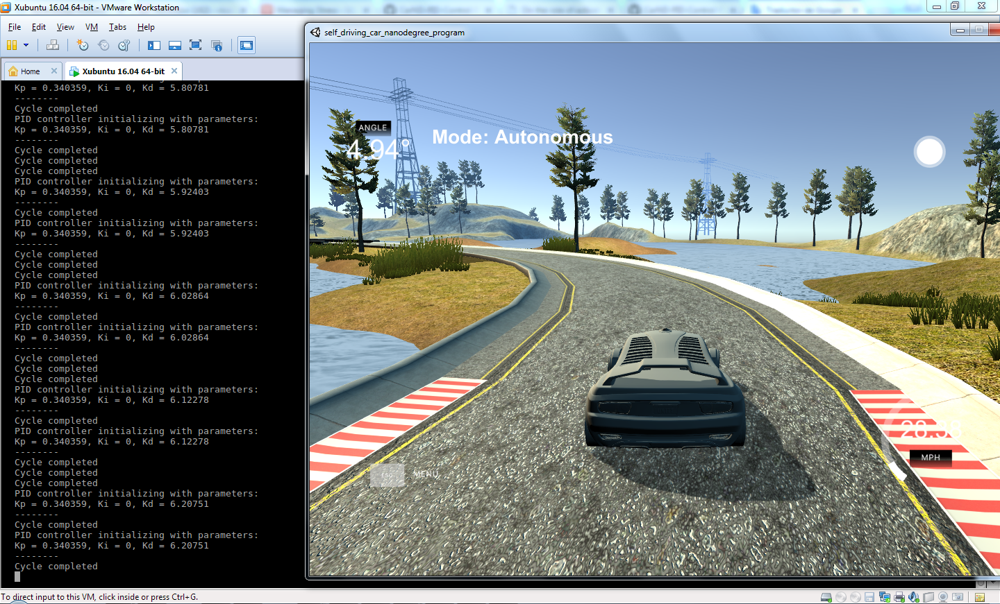

# Reflection #

## Describe the effect each of the P, I, D components had in your implementation. ##

It's very important to start tunning the PID coefficients in the correct order, otherwise it will be very difficult.

**First** it is needed to tune the coefficient of P component, called Kp. A big value will make the vehicle overshoot a lot. However, a good value will only mitigate this effect, but not avoid it. Because of this, it comes the **second** step: tuning the coefficient of D, called Kd. When it its properly done, the vehicle it's almost able to drive perfect, but there are another effect that need to be addressed: bias. Its time for the **third** step: tuning the coefficient of I, called Ki. This part it's mean to fix a bias the vehicle could have toward an specific direction.

As I experienced, if Ki is tuned before Kd is properly set, the vehicle is imposible to drive, as it wil start doing loops and strange movements.

More information about the effect of this parameters and how they were chosen it's in `PID.cpp` in function `void PID::Twiddle_On()`

## Describe how the final hyperparameters were chosen. ##

The Twiddle algorithm was implemented to do so. However, porting the python code from the quizzes to C++ was not enough, it was needed to convert the algorithm to adapt it to an event-oriented design to be able to run with the simulator.

Many times the autonomous driving was needed to be interrupted to avoid the car went out of the lane while the parameters were changing. However, the code was prepared to ignore the inputs when the car is in manual mode.

The tunning algorithm was running until the vehicle was able to perform two laps without having an accident.

More information about the effect of this parameters and how they were chosen it's in `PID.cpp` in function `void PID::Twiddle_On()`